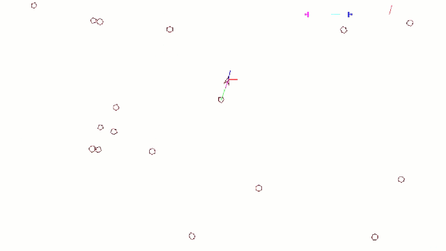

# Asteroids

A 2017 project implementing a simple 2D engine using SDL, used to create an Asteroids clone, featuring Python scripting integration and a basic perceptron for automated gameplay.

## Project Features

### Engine
- Resource management
- Window management
- Frame rate control
- Rendering system
- Configuration system
- Collision management
- Physics system

### Gameplay
- Ship controls
- Score system
- Asteroid spawning and splitting
- Bullet management
- Game rules
- HUD
- Sensor system for environment perception

### Scripting
- Python Integration
- Exposed API for scripts (game state, sensors, actions, ...)
- Full interaction with game objects via scripting 
- Custom event handling

### Artificial Intelligence
- Implementation of a perceptron
- Training data generation
- Asteroid avoidance learning
- Evalusation metrics
- Multiple AI strategies
- Visualization of AI decisions
- Seamless AI integration through Python scripting

## Usage

### Controls
- Arrow keys: Move the ship
- Space: Shoot

### Configuration
The game can be configured via the `config.yaml` file :
Scripting, AI mode, neural network parameters, window size, controls, game rules, ...

## AI

The diagram below illustrates the structure of the neural network, showing the main inputs (game state sensors) and outputs (ship actions) used by the AI to control the ship.

Above, the ship is controlled by a human player (me).  
Below, the ship is controlled by the AI.

## Project Retrospective

Old codebase, with many awkward or improvable parts, but still interesting, especially for the diversity of topics covered.  
This project was developed in 2017; this brief review was written in 2025 with the benefit of hindsight and additional experience.

**Some limitations and areas for improvement:**
- Even though I initially intended to separate game logic from engine logic, the two became increasingly intertwined as the project progressed. Looking back, I realize how much better equipped I am today to maintain a clear separation of concerns and to design more modular architectures.
- Limited use of modern C++ features (e.g., use of raw pointers instead of smart pointers)
- Code quality : no error handling, hardcoded values & magic numbers, hardcoded absolute paths, use of non-descriptive / placeholder variable names, some monolithic code structures, ...
- The perceptron output design could be improved: Using separate binary outputs for each actions can lead to ambiguous or conflicting commands (both left and right rotation simultaneously) -> a more effective approach would be to use a single output for mutually exclusive actions.

**What makes the project valuable:**
- Good example of Python/C++ integration
- Demonstrates scripting and AI in a 2D game context
- Covers a wide range of technical topics : rendering, physics, AI, configuration, ...
- Useful as a learning and experimentation platform